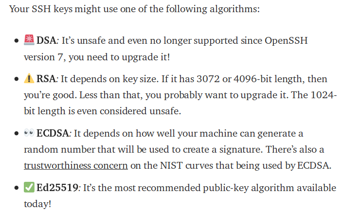

# First Steps in Ubuntu Server / Hardening and Config With Docker

Tested on Digital Ocean; Ubuntu versions 16.04 and 18.04
(So all instructions are executed as ROOT)

Example In Local Computer: 

[](https://asciinema.org/a/jQTQG2bfsRZtN1zwHvgbnP7aL)


Example In Remote Server:
**SOON**


###### Start with this
First of all configure your timezone and your encodings, this command will also install some utilities

    dpkg-reconfigure tzdata && \
    dpkg-reconfigure locales  && \
    apt-get update  && \
    apt-get upgrade -y && \
    apt-get install -y git vim wget curl


###### Install BashIt (Only if you do not use zsh or some similar console)

    git clone --depth=1 https://github.com/Bash-it/bash-it.git ~/.bash_it && ~/.bash_it/install.sh \
    && mkdir -p ~/.bash_it/plugins/enabled/ \
    && ln -s ~/.bash_it/plugins/available/history.plugin.bash ~/.bash_it/plugins/enabled/250---history.plugin.bash \
    && sed -i 's/bobby/sexy/' ~/.bashrc
    
> You can change the last line "sexy" by any of the available themes, exit the console and re-enter to apply https://github.com/Bash-it/bash-it/tree/master/themes
    
###### Environments

It is important that you change these environment variables, with your personal data in Server

    export MY_USERNAME="USERNAMETOCHANGE"; \
    export MY_EMAIL="YOUREMAIL@DOMAINTOCHANGE.COM"; \
    export MY_SERVER_DOMAIN="DOMAINTOCHANGE.COM"; \
    export MY_SERVER_EMAIL_FROM="root@DOMAINTOCHANGE.COM"; \
    export MY_SERVER_SSH_PORT="4444"
For example:
>    export MY_USERNAME="nasatome";

>    export MY_EMAIL="nasatome@mydomain.com";

>    export MY_SERVER_DOMAIN="mydomain.com";

>    export MY_SERVER_EMAIL_FROM="root@mydomain.com";

>    export MY_SERVER_SSH_PORT="4444"
     
And in your **local machine** in the file `~/.bashrc`: 
copy and paste the following (change for your data):
  
    export GIT_COMMITTER_NAME='John Connor'
    export GIT_COMMITTER_EMAIL='john@gmail.com'
    export GIT_AUTHOR_NAME='John Connor'
    export GIT_AUTHOR_EMAIL='john@gmail.com'
 
You can open it with `vim ~/.bashrc` or with your favorite graphical text editor,

If you installed BashIt on your local machine, you can install it after the line. `#export GIT_HOSTING='git@git.domain.com'`


#### Unattended Upgrades
Security updates are very important on any server.

> the second command it's an interactive dialog (respond YES and OK) which will create /etc/apt/apt.conf.d/20auto-upgrades 
    
    apt-get install -y unattended-upgrades update-notifier-common && \
    dpkg-reconfigure --priority=low unattended-upgrades && \
    sed -i 's#//Unattended-Upgrade::Mail "root";#Unattended-Upgrade::Mail "'$MY_EMAIL'";#' /etc/apt/apt.conf.d/50unattended-upgrades &&\
    sed -i 's#//Unattended-Upgrade::MailOnlyOnError#Unattended-Upgrade::MailOnlyOnError#' /etc/apt/apt.conf.d/50unattended-upgrades &&\
    sed -i 's#//Unattended-Upgrade::Automatic-Reboot "false";#Unattended-Upgrade::Automatic-Reboot "true";#' /etc/apt/apt.conf.d/50unattended-upgrades &&\
    sed -i 's#//Unattended-Upgrade::Automatic-Reboot-Time "02:00";#Unattended-Upgrade::Automatic-Reboot-Time "04:00";#' /etc/apt/apt.conf.d/50unattended-upgrades

If you only want to install packages from security sources, run this command:

    sed -i 's#        "${distro_id}:${distro_codename}";#//      "${distro_id}:${distro_codename}";#' /etc/apt/apt.conf.d/50unattended-upgrades
> this will depend on the level of stability you want in your packages


#### Hardening SSH

Now, we will generate new host keys, as well as a new user and add it to the group of administration privileges.

> In your **remote machine**

    ssh-keygen -A && \
    adduser $MY_USERNAME && \
    usermod -aG sudo $MY_USERNAME

> In your **Local Machine** (Laptop o PC With Linux):

[Why ed25519](https://medium.com/risan/upgrade-your-ssh-key-to-ed25519-c6e8d60d3c54)
    

    
Now we will create the new key  
```
ssh-keygen -t ed25519
```
we proceed to add it to the key ring
```
ssh-add ~/.ssh/id_ed25519
```
and we get a public key
```
cat ~/.ssh/id_ed25519.pub
```

> Now In **Remote Machine**

Paste Output in `~/.ssh/authorized_keys` with the following commands 
(Remember to copy and paste only the part of the command and not the part of the username):

from your terminal in root change user

    ROOT #: su $MY_USERNAME
Now create a new folder in case it doesn't exist

    MY_USERNAME $: mkdir ~/.ssh
Now let's change the permissions of the folder, only the owner can modify it
    
    MY_USERNAME $: chmod 700 ~/.ssh
Now we will create the file where the public key that we obtained previously will be copied.
    
    MY_USERNAME $: vim ~/.ssh/authorized_keys

>To use VIM, once inside vim, press the "Ins or Insert" key on your keyboard, until at the bottom right you see a legend that says "-- INSERT --" then paste the contents of the public key you got from your local machine, which you could see when you executed the command "cat ~/.ssh/id_ed25519.pub" above, once the string is pasted, press the ESC key then press the ":" key and then press the "wq" keys visually you should see something like ":wq" which means you can save the file and then exit vim

Now we will change to the correct permissions to the file that has just been created    

    MY_USERNAME $: chmod 600 ~/.ssh/authorized_keys
    
>Example to paste: ssh-ed25519 AAAAC3Nzavrg545t64t34rferfdrferodwEv1MMI2+Nh9QxpgrNxb2Is1Cc6 YOURUSERNAME

Now... Open New Console in your **local machine** and reconect...

    ssh YOUR_USER@YOUR_IP_OR_DOMAIN_DNS

And... once connected with your user test that you can upgrade your privileges to root

    YOURUSERNAME $: sudo -E su root

> Now exec this command in root mode (after executing -> sudo -E su root):

    cp /etc/ssh/sshd_config /etc/ssh/sshd_config.bak \
    && sed -i 's/Port 22/Port '$MY_SERVER_SSH_PORT'/' /etc/ssh/sshd_config \
    && sed -i 's/#Port '$MY_SERVER_SSH_PORT'/Port '$MY_SERVER_SSH_PORT'/' /etc/ssh/sshd_config \
    && sed -i 's/X11Forwarding yes/X11Forwarding no/' /etc/ssh/sshd_config \
    && sed -i 's/AcceptEnv LANG LC_*/AcceptEnv LANG LC_* GIT_*/' /etc/ssh/sshd_config \
    && sed -i 's/PasswordAuthentication yes/PasswordAuthentication no/' /etc/ssh/sshd_config \
    && sed -i 's/PermitRootLogin yes/PermitRootLogin no/' /etc/ssh/sshd_config \
    && sed -zi 's/DebianBanner yes\|$/DebianBanner no\n/' /etc/ssh/sshd_config \
    && sed -zi 's/ClientAliveInterval 60\|$/ClientAliveInterval 60\n/' /etc/ssh/sshd_config \
    && sed -zi 's/ClientAliveCountMax 600\|$/ClientAliveCountMax 600\n/' /etc/ssh/sshd_config \
    && sed -zi 's/AllowAgentForwarding no\|$/AllowAgentForwarding yes/' /etc/ssh/sshd_config


> And now reload ssh service

    systemctl reload sshd

 > **In local machine** To avoid disconnections exec
    
    echo "Host *" >> ~/.ssh/config
    echo "SendEnv LANG LC_* GIT_*" >> ~/.ssh/config
    echo "ServerAliveInterval 60" >> ~/.ssh/config
    echo "ServerAliveCountMax 600" >> ~/.ssh/config
    echo "ForwardAgent yes" >> ~/.ssh/config

> And now test:

    cat ~/.ssh/config
    
> You should see this exit

    <<---------~/.ssh/config--------------
    Host *
    SendEnv LANG LC_* GIT_*
    ServerAliveInterval 60
    ServerAliveCountMax 600
    ForwardAgent yes
    <<------------------------------------
    
    
> Apart from the global and repository configuration settings, Git reads the environment variables GIT_AUTHOR_NAME, GIT_AUTHOR_EMAIL, GIT_COMMITTER_NAME and GIT_COMMITTER_EMAIL. The idea now is to set them on your machine and take them via SSH on every single machine.
Local setup

> At first you need to set the variables in your .bashrc file:

> And now test connection in other **local machine** terminal 

> (Don't forget to change the 4444 to the port you have assigned in your SSH environment variable in remote 7server)

    ssh -p 4444 USERNAMETOCHANGE@YOUR_IP_OR_DOMAIN_DNS

Now In **remote server**): exec this commands

    sudo -E su root

and one of these commands 

    echo "$SSH_AUTH_SOCK"
    ssh-add -L
    ssh -T git@github.com

> Everyone should give you positive outcomes; for example github command response:

```
Hi YOURGITUSERNAME! You've successfully authenticated, but GitHub does not provide shell access.
```

> Remember that you must add your SSH key to your GITHUB account

   `https://help.github.com/articles/adding-a-new-ssh-key-to-your-github-account/`
   
###### Over Firewalld
    firewalld.org
For Ubuntu 18.04 in other VPS Providers, it seems firewalld has become the default where ufw is installed but inactive.
if you execute the following commands you can check if ufw is active

```
    root@localhost:~# firewall-cmd --state 
    running
    root@localhost:~# ufw status
    Status: inactive
```
If this is your case, then these commands can be useful. (otherwise, skip this section)

    firewall-cmd --permanent --zone=public --add-service={http,https}
    firewall-cmd --permanent --zone=public --add-port=$MY_SERVER_SSH_PORT/tcp
    firewall-cmd --permanent --zone=public --remove-service=ssh --permanent
    
    firewall-cmd --permanent --direct --add-rule ipv4 filter INPUT 0 -j LOG && \
    firewall-cmd --permanent --direct --add-rule ipv4 filter FORWARD 0 -j LOG && \
    firewall-cmd --permanent --direct --add-rule ipv6 filter INPUT 0 -j LOG && \
    firewall-cmd --permanent --direct --add-rule ipv6 filter FORWARD 0 -j LOG
    
The `firewall-cmd –reload` command is necessary to activate the change. Contrary to the `–complete-reload` option, current connections are not stopped.
More Info: https://www.certdepot.net/rhel7-get-started-firewalld/


#### Firewall UFW And IPTABLES Persistent

Install ufw
    
    apt-get install -y ufw
 
 Disable incoming ports
    
    ufw allow $MY_SERVER_SSH_PORT && ufw allow http && ufw allow https && ufw default deny incoming && ufw enable && ufw logging on
 
Install iptables-persistent

    apt-get install iptables-persistent 

Enable Logs of iptables   

    iptables -A INPUT -j LOG \
    && iptables -A FORWARD -j LOG \
    && ip6tables -A INPUT -j LOG \
    && ip6tables -A FORWARD -j LOG

###### Network Hardening

    sed -i 's/#net.ipv4.conf.default.rp_filter=1/net.ipv4.conf.default.rp_filter=1/' /etc/sysctl.conf \
    && sed -i 's/#net.ipv4.conf.all.rp_filter=1/net.ipv4.conf.all.rp_filter=1/' /etc/sysctl.conf \
    && sed -i 's/#net.ipv4.conf.all.accept_source_route = 0/net.ipv4.conf.all.accept_source_route = 0/' /etc/sysctl.conf \
    && sed -i 's/#net.ipv6.conf.all.accept_source_route = 0/net.ipv6.conf.all.accept_source_route = 0/' /etc/sysctl.conf \
    && sed -i 's/#net.ipv4.conf.all.send_redirects = 0/net.ipv4.conf.all.send_redirects = 0/' /etc/sysctl.conf \
    && sed -i 's/#net.ipv4.tcp_syncookies=1/net.ipv4.tcp_syncookies=1/' /etc/sysctl.conf \
    && sed -i 's/#net.ipv4.conf.all.log_martians = 1/net.ipv4.conf.all.log_martians = 1/' /etc/sysctl.conf \
    && sed -i 's/#net.ipv4.conf.all.accept_redirects = 0/net.ipv4.conf.all.accept_redirects = 0/' /etc/sysctl.conf \
    && sed -i 's/#net.ipv6.conf.all.accept_redirects = 0/net.ipv6.conf.all.accept_redirects = 0/' /etc/sysctl.conf
    
Now Reload With

    sysctl -p
    
And Now

    sed -i 's/order hosts,bind/order bind,hosts/' /etc/host.conf
    
#### Fail2Ban and PSAD

Now Install

    apt-get install -y fail2ban psad
    
And exec

    sed -i 's/destemail = root@localhost/destemail = '$MY_EMAIL'/' /etc/fail2ban/jail.conf \
    && sed -i 's/sender = root@localhost/sender = '$MY_SERVER_EMAIL_FROM'/' /etc/fail2ban/jail.conf \
    && sed -i 's/action = %(action_)s/action = %(action_mwl)s/' /etc/fail2ban/jail.conf \
    && echo "[nginx-http-auth]" > /etc/fail2ban/jail.local \
    && echo "enabled  = false" >> /etc/fail2ban/jail.local \
    && echo "filter   = nginx-http-auth" >> /etc/fail2ban/jail.local \
    && echo "port     = http,https" >> /etc/fail2ban/jail.local \
    && echo "logpath  = %(nginx_error_log)s" >> /etc/fail2ban/jail.local \
    && echo "#logpath  = /opt/prj/dockavel/data/log/nginx/error.log" >> /etc/fail2ban/jail.local \
    && echo "" >> /etc/fail2ban/jail.local \
    && echo "[nginx-noscript]" >> /etc/fail2ban/jail.local \
    && echo "enabled  = false" >> /etc/fail2ban/jail.local \
    && echo "port     = http,https" >> /etc/fail2ban/jail.local \
    && echo "filter   = nginx-noscript" >> /etc/fail2ban/jail.local \
    && echo "logpath  = %(nginx_error_log)s" >> /etc/fail2ban/jail.local \
    && echo "#logpath  = /opt/prj/dockavel/data/log/nginx/error.log" >> /etc/fail2ban/jail.local \
    && echo "maxretry = 6" >> /etc/fail2ban/jail.local \
    && echo "" >> /etc/fail2ban/jail.local \
    && echo "[ssh]" >> /etc/fail2ban/jail.local \
    && echo "enabled = true" >> /etc/fail2ban/jail.local \
    && echo "port    = $MY_SERVER_SSH_PORT" >> /etc/fail2ban/jail.local \
    && echo "filter  = sshd" >> /etc/fail2ban/jail.local \
    && echo "logpath = /var/log/auth.log" >> /etc/fail2ban/jail.local \
    && echo "maxretry = 4" >> /etc/fail2ban/jail.local \
    && echo "" >> /etc/fail2ban/jail.local \
    && echo "[ssh-ddos]" >> /etc/fail2ban/jail.local \
    && echo "enabled = true" >> /etc/fail2ban/jail.local \
    && echo "port    = $MY_SERVER_SSH_PORT" >> /etc/fail2ban/jail.local \
    && echo "filter  = sshd-ddos" >> /etc/fail2ban/jail.local \
    && echo "logpath = /var/log/auth.log" >> /etc/fail2ban/jail.local \
    && echo "" >> /etc/fail2ban/jail.local \
    && echo "[Definition]" > /etc/fail2ban/filter.d/nginx-http-auth.conf \
    && echo 'failregex = ^ \[error\] \d+#\d+: \*\d+ user "\S+":? (password mismatch|was not found in ".*"), client: <HOST>, server: \S+, request: "\S+ \S+ HTTP/\d+\.\d+", host: "\S+"\s*$' >> /etc/fail2ban/filter.d/nginx-http-auth.conf \
    && echo "ignoreregex =" >> /etc/fail2ban/filter.d/nginx-http-auth.conf \
    && echo "[Definition]" > /etc/fail2ban/filter.d/nginx-noscript.conf \
    && echo "failregex = ^<HOST> -.*GET.*(\.asp|\.exe|\.pl|\.cgi|\.scgi)" >> /etc/fail2ban/filter.d/nginx-noscript.conf \
    && echo "ignoreregex =" >> /etc/fail2ban/filter.d/nginx-noscript.conf

> Now restart
    
    systemctl restart fail2ban

> For psad config
    
    sed -i 's/EMAIL_ADDRESSES             root@localhost;/EMAIL_ADDRESSES             '$MY_EMAIL';/' /etc/psad/psad.conf \
    && sed -i 's/HOSTNAME                    _CHANGEME_;/HOSTNAME                    '$MY_SERVER_DOMAIN';/' /etc/psad/psad.conf \
    && sed -i 's/ENABLE_AUTO_IDS             N;/ENABLE_AUTO_IDS             Y;/' /etc/psad/psad.conf \
    && sed -i 's/DANGER_LEVEL2               15;/DANGER_LEVEL2               15;/' /etc/psad/psad.conf \
    && sed -i 's/DANGER_LEVEL3               150;/DANGER_LEVEL3               30;/' /etc/psad/psad.conf \
    && sed -i 's/DANGER_LEVEL4               1500;/DANGER_LEVEL4               100;/' /etc/psad/psad.conf \
    && sed -i 's/DANGER_LEVEL5               10000;/DANGER_LEVEL5               300;/' /etc/psad/psad.conf \
    && sed -i 's/EMAIL_ALERT_DANGER_LEVEL    1;/EMAIL_ALERT_DANGER_LEVEL    5;/' /etc/psad/psad.conf \
    && sed -i 's/EMAIL_LIMIT                 0;/EMAIL_LIMIT                 1;/' /etc/psad/psad.conf \
    && sed -i 's/EMAIL_LIMIT_STATUS_MSG      Y;/EMAIL_LIMIT_STATUS_MSG      N;/' /etc/psad/psad.conf \
    && sed -i 's/ENABLE_AUTO_IDS_EMAILS      Y;/ENABLE_AUTO_IDS_EMAILS      N;/' /etc/psad/psad.conf \
    && sed -i 's/AUTO_IDS_DANGER_LEVEL       5;/AUTO_IDS_DANGER_LEVEL       1;/' /etc/psad/psad.conf \
    && sed -i 's#IPT_SYSLOG_FILE             /var/log/messages;#IPT_SYSLOG_FILE             /var/log/syslog;#' /etc/psad/psad.conf
    

Now Update
    
    psad --sig-update 
    
And Check

    service rsyslog restart

In the following command, all outputs with a + sign must appear
    psad --fw-analyze

Now you can restart the service with any of these commands
    psad -H
    psad -R   
    
###### Protect/Block TOR IPs
>     This only works if you don't open the ports you are going to protect from docker, since docker gives more privilege to the rules from iptables than the ones generated by this script.

    [Block TOR IPs](https://github.com/nasatome/block_tor_net_by_iptables)
    
###### Save IpTables
Now save firewall rules
    netfilter-persistent save

##### Install Docker

Review Script Docker:

´https://get.docker.com/´

And Exec

    curl -fsSL get.docker.com -o get-docker.sh && sh get-docker.sh
 
 (for not production mode)   
   
    curl -fsSL test.docker.com -o get-docker.sh && sh get-docker.sh 
    
> Can verify with
    
    docker info
    docker version
    
> Now test Docker

    docker run hello-world

#### Install Docker Compose 

> Review last stable release: https://github.com/docker/compose/releases

Get docker-compose version in ENV variable:
    
    COMPOSE_VERSION=`git ls-remote https://github.com/docker/compose | grep refs/tags | grep -oP "[0-9]+\.[0-9][0-9]+\.[0-9]+$" | tail -n 1`

Install docker-compose    
    
    curl -L https://github.com/docker/compose/releases/download/${COMPOSE_VERSION}/docker-compose-`uname -s`-`uname -m` -o /usr/local/bin/docker-compose && chmod +x /usr/local/bin/docker-compose && docker-compose --version
    
    
###### Check for rootkits
install 

    apt-get install chkrootkit
    

###### Install RKhunter by source
    
    read -P "What is RKHunter Download Link? ( example: 1.4.6 )" RKPKG
    RKLNK="https://sourceforge.net/projects/rkhunter/files/rkhunter/$RKPKG/rkhunter-$RKPKG.tar.gz/download"
    wget -P /usr/local/src $RKLNK
    tar -zxvf rkhunter-$RKPKG.tar.gz --directory /usr/local/src
    cd rkhunter-$RKPKG.tar.gz 
    ./installer.sh --layout default --install /usr/local/bin/rkhunter --update /usr/local/bin/rkhunter --propupd
    rm -rf /usr/local/src/rkhunter*

###### Add mail on rootkiits on crontab

    crontab -l > crontab.bak
    cat<<EOF> /etc/cron.daily/rkhunter.sh
    #!/bin/sh(/usr/local/bin/rkhunter --versioncheck/usr/local/bin/rkhunter --update/usr/local/bin/rkhunter --cronjob --report-warnings-only)
    /bin/mail -s 'rkhunter Daily Run ($HOSTNAME)' $MY_EMAIL
    EOF
    chmod 700 /etc/cron.daily/rkhunter.sh
    

now test

    chkrootkit
    
now test 2

    rkhunter --update
    rkhunter --propupd
    rkhunter --check
    rkhunter -c -sk
    
    
    
    
    
>todo:

* add to cron: check rootkits with mail - DONE !?
* Tiger and Tripwire
* https://www.digitalocean.com/community/questions/best-practices-for-hardening-new-sever-in-2017
